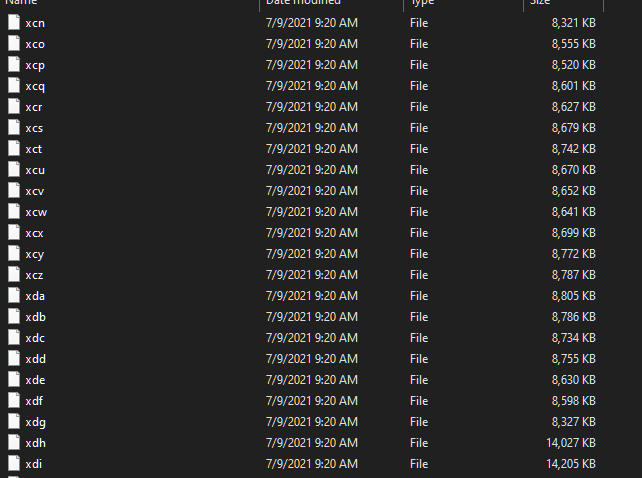

# JSON-Plaintext-to-SQL
This is an example code of converting a large scale (16gb) JSON dump failure to usable SQL DB.

## The Issue

This was a large scale reddit API scrape of the subreddit r/videos. But the scraping script failed to output proper JSON objects.

Rather than dumping the JSON object from the API approporiately the script appended each JSON object response as a plaintext to a file formated JSON. The appropriate JSON would have been the following -

```JSON
[{"author": "[deleted]", "author_flair_css_class": null, "author_flair_text": null, "created_utc": 1356998512, "domain": "youtube.com", "full_link": "https://www.reddit.com/r/videos/comments/15qzf0/as_2013_approaches_look_back_on_the_past_year_in/", "gilded": 0, "id": "15qzf0", "is_self": false, "media_embed": {}, "mod_reports": [], "num_comments": 0, "over_18": false, "permalink": "/r/videos/comments/15qzf0/as_2013_approaches_look_back_on_the_past_year_in/", "retrieved_on": 1413242528, "score": 1, "secure_media_embed": {}, "selftext": "", "stickied": false, "subreddit": "videos", "subreddit_id": "t5_2qh1e", "thumbnail": "default", "title": "As 2013 approaches, look back on the past year in movies. \"2012: The Cinescape\" by Matt Shapiro.", "url": "http://www.youtube.com/watch?&amp;v=qVw1_PadudE", "user_reports": []},

{"author": "[deleted]", "author_flair_css_class": null, "author_flair_text": null, "created_utc": 1356998655, "domain": "youtube.com", "full_link": "https://www.reddit.com/r/videos/comments/15qzk2/happy_new_year/", "gilded": 0, "id": "15qzk2", "is_self": false, "media": {"oembed": {"author_name": "DamItsGood808", "author_url": "http://www.youtube.com/user/DamItsGood808", "description": "HAPPY NEW YEAR!!! SEND TO YOUR FRIENDS! music by Neil Cicierega - http://www.youtube.com/user/neilcicierega", "height": 338, "html": "&lt;iframe width=\"600\" height=\"338\" src=\"http://www.youtube.com/embed/nRkVa1-Iog8?feature=oembed\" frameborder=\"0\" allowfullscreen&gt;&lt;/iframe&gt;", "provider_name": "YouTube", "provider_url": "http://www.youtube.com/", "thumbnail_height": 360, "thumbnail_url": "http://i3.ytimg.com/vi/nRkVa1-Iog8/hqdefault.jpg", "thumbnail_width": 480, "title": "2013 DANCE!!!", "type": "video", "url": "http://www.youtube.com/watch?v=nRkVa1-Iog8", "version": "1.0", "width": 600}, "type": "youtube.com"}, "media_embed": {"content": "&lt;iframe width=\"600\" height=\"338\" src=\"http://www.youtube.com/embed/nRkVa1-Iog8?feature=oembed\" frameborder=\"0\" allowfullscreen&gt;&lt;/iframe&gt;", "height": 338, "scrolling": false, "width": 600}, "mod_reports": [], "num_comments": 0, "over_18": false, "permalink": "/r/videos/comments/15qzk2/happy_new_year/", "retrieved_on": 1413242522, "score": 0, "secure_media_embed": {}, "selftext": "", "stickied": false, "subreddit": "videos", "subreddit_id": "t5_2qh1e", "thumbnail": "default", "title": "Happy New Year", "url": "http://www.youtube.com/watch?v=nRkVa1-Iog8", "user_reports": []}]
```

But the file was -

```
{"author": "[deleted]", "author_flair_css_class": null, "author_flair_text": null, "created_utc": 1356998512, "domain": "youtube.com", "full_link": "https://www.reddit.com/r/videos/comments/15qzf0/as_2013_approaches_look_back_on_the_past_year_in/", "gilded": 0, "id": "15qzf0", "is_self": false, "media_embed": {}, "mod_reports": [], "num_comments": 0, "over_18": false, "permalink": "/r/videos/comments/15qzf0/as_2013_approaches_look_back_on_the_past_year_in/", "retrieved_on": 1413242528, "score": 1, "secure_media_embed": {}, "selftext": "", "stickied": false, "subreddit": "videos", "subreddit_id": "t5_2qh1e", "thumbnail": "default", "title": "As 2013 approaches, look back on the past year in movies. \"2012: The Cinescape\" by Matt Shapiro.", "url": "http://www.youtube.com/watch?&amp;v=qVw1_PadudE", "user_reports": []}

{"author": "[deleted]", "author_flair_css_class": null, "author_flair_text": null, "created_utc": 1356998655, "domain": "youtube.com", "full_link": "https://www.reddit.com/r/videos/comments/15qzk2/happy_new_year/", "gilded": 0, "id": "15qzk2", "is_self": false, "media": {"oembed": {"author_name": "DamItsGood808", "author_url": "http://www.youtube.com/user/DamItsGood808", "description": "HAPPY NEW YEAR!!! SEND TO YOUR FRIENDS! music by Neil Cicierega - http://www.youtube.com/user/neilcicierega", "height": 338, "html": "&lt;iframe width=\"600\" height=\"338\" src=\"http://www.youtube.com/embed/nRkVa1-Iog8?feature=oembed\" frameborder=\"0\" allowfullscreen&gt;&lt;/iframe&gt;", "provider_name": "YouTube", "provider_url": "http://www.youtube.com/", "thumbnail_height": 360, "thumbnail_url": "http://i3.ytimg.com/vi/nRkVa1-Iog8/hqdefault.jpg", "thumbnail_width": 480, "title": "2013 DANCE!!!", "type": "video", "url": "http://www.youtube.com/watch?v=nRkVa1-Iog8", "version": "1.0", "width": 600}, "type": "youtube.com"}, "media_embed": {"content": "&lt;iframe width=\"600\" height=\"338\" src=\"http://www.youtube.com/embed/nRkVa1-Iog8?feature=oembed\" frameborder=\"0\" allowfullscreen&gt;&lt;/iframe&gt;", "height": 338, "scrolling": false, "width": 600}, "mod_reports": [], "num_comments": 0, "over_18": false, "permalink": "/r/videos/comments/15qzk2/happy_new_year/", "retrieved_on": 1413242522, "score": 0, "secure_media_embed": {}, "selftext": "", "stickied": false, "subreddit": "videos", "subreddit_id": "t5_2qh1e", "thumbnail": "default", "title": "Happy New Year", "url": "http://www.youtube.com/watch?v=nRkVa1-Iog8", "user_reports": []}
```

The script also didn't handle the JSON response dump appropriately to a DB either an SQL or a NoSQL db, this huge set was appended to a plaintext file. This resulted in a 16 gb plaintext file that was difficult to be processed any standard operation.

## The Desired Output

The desired output operation is -

1. Convert the plaintext file to an SQLite3 db
2. Extract only the necessary keys from the JSON objects and convert them to columns

---

## Tools

For this operation I will be using the following tools-

1. Scripting language: Python
1. Python Modules: ```JSON```
1. DB: SQLite3
1. Version Control: Git, Github
1. Additional tools: Terminal applications (```head```, ```split```)


## Process

### Breaking down the 16 gb file

The 16 gb file is too large for any standard machine to handle. So I first start by breaking down the file into smaller manageable pieces with the terminal application called ```split```. The command was -

```shell
split -l 5000 .\submissions.json^C
```

The argument for the `split` application

1. `-l` split by lines
1. `5000` split on every 5000 lines of the file
1. `submission.json` that 16 gb plaintext file



This operation resulted in 965 files that is divided in 5000 lines. Each file has different file size as I splitted the file by lines and not by size.

